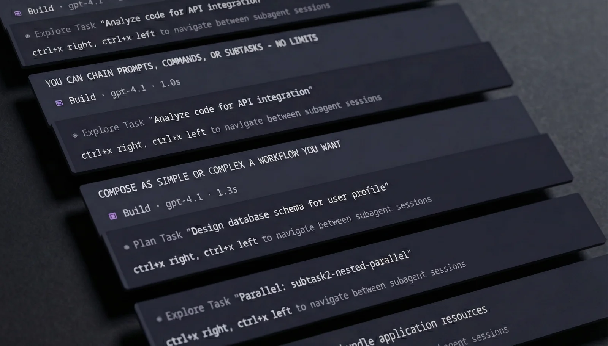
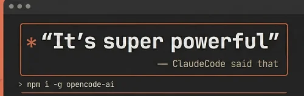

# A stronger opencode /command handler

### TL:DR - More agency, control and capabilities for commands

This plugin affects how opencode handles slash commands with additional frontmatter parameters and enables chaining as well as parallel command execution. It's simple to use and designed to allow better orchestration, steerability and lifespan of the agentic loop. Compose as simple or complex a workflow as you want. If you already know opencode commands, you'll be right at home.

`@openspoon/subtask2@latest`





### Key features

- `return` instruct main session on **command/subtask(s)** result - _can be chained, supports /commands_
- `parallel` run subtasks concurrently - _pending PR merge ⚠️_
- `arguments` pass arguments with command frontmatter or `||` message pipe

Requires [this PR](https://github.com/sst/opencode/pull/6478) for `parallel` features, as well as proper model inheritance (piping the right model and agent to the right subtask and back) to work.

---

<details>
<summary><strong>Feature documentation</strong></summary>

### 1. `return` - Or the old 'look again' trick

Use `return` to tell the main agent what to do after a command completes, supports chaining and triggering other commands. The `return` prompt is appended to the main session on command or subtask completion.

```yaml
subtask: true
return: Look again, challenge the findings, then implement the valid fixes.
---
Review the PR# $ARGUMENTS for bugs.
```

For multiple sequential prompts, use an array:

```yaml
subtask: true
return:
  - Implement the fix
  - Run the tests
---
Find the bug in auth.ts
```

**Trigger /commands in return** using `/command args` syntax:

```yaml
subtask: true
return:
  - /revise-plan make the UX as horribly impractical as imaginable
  - /implement-plan
  - Send this to my mother in law
---
Design the auth system for $ARGUMENTS
```

By default, opencode injects a user message after a `subtask: true` completes, asking the model to "summarize the task tool output..." - Subtask2 replaces that message with the `return` prompt

- **First** `return` replaces opencode's "summarize" message or fires as a follow-up
- **Any additional** `return` fire sequentially after each LLM turn completes
- **Commands** (starting with `/`) are executed as full commands with their own `parallel` and `return`

### 2. `parallel` - Run multiple subtasks concurrently ⚠️ **PENDING PR**

Spawn additional command subtasks alongside the main one:

`plan.md`

```yaml
subtask: true
parallel:
  - /plan-gemini
  - /plan-opus
return:
  - Compare and challenge the plans, keep the best bits and make a unified proposal
  - Critically review the plan directly against what reddit has to say about it
---
Plan a trip to $ARGUMENTS.
```

This runs 3 subtasks in parallel:

1. The main command (`plan.md`)
2. `plan-gemini`
3. `plan-opus`

When ALL complete, the main session receives the `return` prompt of the main command

### With custom arguments per command

You can pass arguments inline when using the command with `||` separators.
Pipe segments map in chronological order: main → parallels → return /commands

```bash
/mycommand main args || pipe1 || pipe2 || pipe3
```

and or

```yaml
parallel:
  - command: research-docs
    arguments: authentication flow
  - command: research-codebase
    arguments: auth middleware implementation
  - /security-audit
return: Synthesize all findings into an implementation plan.
```

- `research-docs` gets "authentication flow" as `$ARGUMENTS`
- `research-codebase` gets "auth middleware implementation"
- `security-audit` inherits the main command's `$ARGUMENTS`

You can use `/command args` syntax for inline arguments:

```yaml
parallel: /security-review focus on auth, /perf-review check db queries
```

Or for all commands to inherit the main `$ARGUMENTS`:

```yaml
parallel: /research-docs, /research-codebase, /security-audit
```

**Note:** Parallel commands are forced into subtasks regardless of their own `subtask` setting. Their `return` are ignored - only the parent's `return` applies. Nested parallels are automatically flattened (max depth: 5).

#### Priority: pipe args > frontmatter args > inherit main args

### 3. Subtask `return` fallback and custom defaults

For `subtask: true` commands, this plugin replaces the opencode generic "summarize" message with the `return` prompt. If undefined and `"replace_generic": true`, subtask2 uses:

> Review, challenge and validate the task output against the codebase then continue with the next logical step.

Configure in `~/.config/opencode/subtask2.jsonc`:

```jsonc
{
  // Replace generic prompt when no 'return' is specified
  "replace_generic": true, // defaults to true

  // Custom fallback (optional - has built-in default)
  "generic_return": "custom return prompt"
}
```

#### Priority: `return` param > config `generic_return` > built-in default > opencode original

</details>

<details>
<summary><strong>Some examples</strong></summary>

**Parallel subtask with different models (A/B/C plan comparison)**

```yaml
---
description: multi-model ensemble, 3 models plan in parallel, best ideas unified
model: github-copilot/claude-opus-4.5
subtask: true
parallel: /plan-gemini, /plan-gpt
return:
  - Compare all 3 plans and validate each directly against the codebase. Pick the best ideas from each and create a unified implementation plan.
  - /review-plan focus on simplicity and correctness
---
Plan the implementation for the following feature
> $ARGUMENTS
```

**Isolated "Plan" mode**

```yaml
---
description: two-step implementation planning and validation
agent: build
subtask: true
return:
  - Challenge, verify and validate the plan by reviewing the codebase directly. Then approve, revise, or reject the plan. Implement if solid
  - Take a step back, review what was done/planned for correctness, revise if needed
---
In this session you WILL ONLY PLAN AND NOT IMPLEMENT. You are to take the `USER INPUT` and research the codebase until you have gathered enough knowledge to elaborate a full fledged implementation plan

You MUST consider alternative paths and keep researching until you are confident you found the BEST possible implementation

BEST often means simple, lean, clean, low surface and coupling
Make it practical, maintainable and not overly abstracted

Follow your heart
> DO NOT OVERENGINEER SHIT

USER INPUT
$ARGUMENTS
```

**Multi-step workflow**

```yaml
---
description: design, implement, test, document
agent: build
model: github-copilot/claude-opus-4.5
subtask: true
return:
  - Implement the component following the conceptual design specifications.
  - Write comprehensive unit tests for all edge cases.
  - Update the documentation and add usage examples.
  - Run the test suite and fix any failures.
---
Conceptually design a React modal component with the following requirements
> $ARGUMENTS
```

</details>

<details>
<summary><strong>Demo files</strong></summary>

Prompt used in the demo:
`/subtask2 10 || pipe2 || pipe3 || pipe4 || pipe5`

`subtask2.md`

```yaml
---
description: subtask2 plugin test command
agent: build
subtask: true
parallel: /subtask2-parallel-test PARALLEL
return:
  - say the phrase "THE RETURN PROMPT MADE ME SAY THIS" and do NOTHING else
  - say the phrase "YOU CAN CHAIN PROMPTS, COMMANDS, OR SUBTASKS - NO LIMITS" and do NOTHING else
  - /subtask2-nested-parallel CHAINED-COMMAND-SUBTASK
---
please count to $ARGUMENTS
```

`subtask2-parallel-test.md`

```yaml
---
agent: plan
model: github-copilot/grok-code-fast-1
parallel: /subtask2-nested-parallel NESTED-PARALLEL
subtask: true
---
say the word "$ARGUMENTS" 3 times
```

`subtask2-nested-parallel.md`

```yaml
---
agent: explore
model: github-copilot/gpt-4.1
subtask: true
return:
  - say the phrase "COMPOSE AS SIMPLE OR COMPLEX A WORKFLOW AS YOU WANT" and do NOTHING else
  - /subtask2-parallel-test LAST CALL
---
say the word "$ARGUMENTS" 3 times
```

</details>

<details>
<summary><strong>Installation</strong></summary>
To install, add subtask2 to your opencode config plugin array

```json
{
  "plugins": ["@openspoon/subtask2@latest"]
}
```

</details>

---


