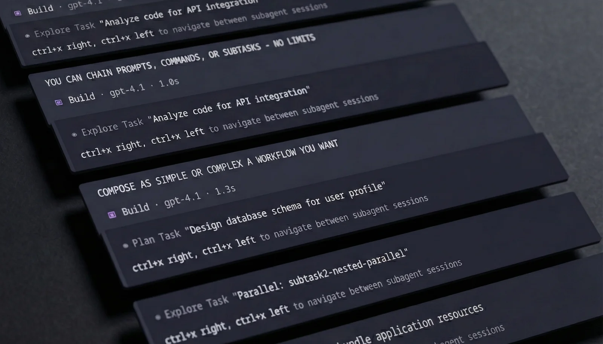
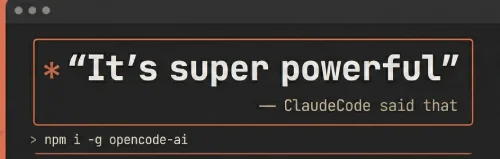

## A better opencode `/command` handler



### TL:DR - Lower session entropy with a more deterministic agentic loop

This plugin allows your opencode `/commands` to:

- **Chain** `prompts`, `/commands` and `subagents` seamlessly
- **Relay** subagent results or session context to other subagents
- **Loop** or **parallelize** subagents
- **Run** commands on the fly with the `/subtask` command
- **Override** `/commands` parameters inline (model, agent, return, parallel...)

If you already use opencode `/commands`, you'll be right at home, if not, start with [this page](https://opencode.ai/docs/commands/)



**To install**, add subtask2 to your opencode configuration

```json
{
  "plugins": ["@spoons-and-mirrors/subtask2@latest"]
}
```

---

### Key Features

- `return` instruct main session on command/subtask(s) result
- `loop` loop subtask until user condition is met
- `parallel` run subtasks concurrently - _pending PR_
- `$TURN[n]` pass session turns (user/assistant messages)
- `{as:name}` + `$RESULT[name]` capture and reference subtask outputs
- Inline syntax for model, agent, and ad-hoc subtasks

Requires [this PR](https://github.com/sst/opencode/pull/6478) for the `parallel` feature

---

<details>
<summary><strong>1. <code>return</code> - Chaining prompts and commands</strong></summary>

### 1. `return` - Chaining prompts and commands

Use `return` to tell the main agent what to do after a command completes. Supports prompts, /commands, and chaining.

```yaml
subtask: true
return: Look again, challenge the findings, then implement the valid fixes.
---
Review the PR# $ARGUMENTS for bugs.
```

For multiple sequential prompts, use an array:

```yaml
subtask: true
return:
  - Implement the fix
  - Run the tests
---
Find the bug in auth.ts
```

**Trigger /commands in return**

```yaml
subtask: true
return:
  - /revise-plan make the UX as horribly impractical as imaginable
  - /implement-plan
  - Send this to my mother in law
---
Design the auth system for $ARGUMENTS
```

**How return prompts work:**

When a `subtask: true` completes, OpenCode normally injects a hidden synthetic user message asking the model to "summarize the task tool output..." - Subtask2 completely removes this message and handles returns differently:

- **Prompt returns**: Fired as **real user messages** visible in your conversation. You'll see the return prompt appear as if you typed it.
- **Command returns** (starting with `/`): The command executes immediately.

This gives you full visibility into what's driving the agent's next action.

`/commands` are executed as full commands with their own `parallel` and `return`

</details>

<details>
<summary><strong>2. <code>loop</code> - Repeat until condition is met</strong></summary>

### 2. `loop` - Repeat until condition is met

Run a command repeatedly, either a fixed number of times or until a condition is satisfied.

**Unconditional loop (fixed iterations):**

```bash
/generate-tests {loop:5} generate unit tests for auth module
```

Runs exactly 5 times with no evaluation - the main session just yields between iterations.

**Conditional loop (with evaluation):**

```bash
/fix-tests {loop:10 && until:all tests pass with good coverage}
```

**Frontmatter:**

```yaml
---
loop:
  max: 10
  until: "all features implemented correctly"
---
Implement the auth system.
```

**In return chains:**

```yaml
return:
  - /implement-feature
  - /fix-tests {loop:5 && until:tests are green}
  - /commit
```

**How it works (orchestrator-decides pattern):**

1. Subtask runs and completes
2. Main session receives evaluation prompt with the condition
3. Main LLM evaluates: reads files, checks git, runs tests if needed
4. Responds with `<subtask2 loop="break"/>` (satisfied) or `<subtask2 loop="continue"/>` (more work needed)
5. If continue → loop again. If break → proceed to next step
6. Max iterations is a safety net

**Why this works:**

- The main session (orchestrator) has full context of what was done
- It can verify by reading actual files, git diff, test output
- No fake "DONE" markers - real evaluation of real conditions
- The `until:` is a human-readable condition, not a magic keyword

**Best practices:**

- Write clear conditions: `until: "tests pass"` not `until: "DONE"`
- Always set a reasonable `max` as a safety net
- The condition is shown to the evaluating LLM verbatim

**Priority:** inline `{loop:...}` > frontmatter `loop:`

</details>

<details>
<summary><strong>3. <code>parallel</code> - Run subtasks concurrently</strong></summary>

### 3. `parallel` - Run subtasks concurrently

Spawn additional command subtasks alongside the main one:

`plan.md`

```yaml
subtask: true
parallel:
  - /plan-gemini
  - /plan-opus
return:
  - Compare and challenge the plans, keep the best bits and make a unified proposal
  - Critically review the plan directly against what reddit has to say about it
---
Plan a trip to $ARGUMENTS.
```

This runs 3 subtasks in parallel:

1. The main command (`plan.md`)
2. `plan-gemini`
3. `plan-opus`

When ALL complete, the main session receives the `return` prompt of the main command

### With custom arguments per command

You can pass arguments inline when using the command with `||` separators.
Pipe segments map in chronological order: main → parallels → return /commands

```bash
/mycommand main args || pipe1 || pipe2 || pipe3
```

and/or

```yaml
parallel:
  - command: research-docs
    arguments: authentication flow
  - command: research-codebase
    arguments: auth middleware implementation
  - /security-audit
return: Synthesize all findings into an implementation plan.
```

- `research-docs` gets "authentication flow" as `$ARGUMENTS`
- `research-codebase` gets "auth middleware implementation"
- `security-audit` inherits the main command's `$ARGUMENTS`

You can use `/command args` syntax for inline arguments:

```yaml
parallel: /security-review focus on auth, /perf-review check db queries
```

Or for all commands to inherit the main `$ARGUMENTS`:

```yaml
parallel: /research-docs, /research-codebase, /security-audit
```

**Note:** Parallel commands are forced into subtasks regardless of their own `subtask` setting. Their `return` are ignored - only the parent's `return` applies. Nested parallels are automatically flattened with a **maximum depth of 5** to prevent infinite recursion.

#### Priority: pipe args > frontmatter args > inherit main args

</details>

<details>
<summary><strong>4. Context & Results - <code>$TURN</code>, <code>{as:name}</code>, <code>$RESULT</code></strong></summary>

### 4. Context & Results

Pass conversation context to subtasks and capture their outputs for later use.

---

#### `$TURN[n]` - Reference previous conversation turns

Use `$TURN[n]` to inject the last N conversation turns (user + assistant messages) into your command. This is powerful for commands that need context from the ongoing conversation.

```yaml
---
description: summarize our conversation so far
subtask: true
---
Review the following conversation and provide a concise summary:

$TURN[10]
```

**Syntax options:**

- `$TURN[6]` - last 6 messages
- `$TURN[:3]` - just the 3rd message from the end
- `$TURN[:2:5:8]` - specific messages at indices 2, 5, and 8
- `$TURN[*]` - all messages in the session

**Usage in arguments:**

```bash
/my-command analyze this $TURN[5]
```

**Format output:**

```
--- USER ---
What's the best way to implement auth?

--- ASSISTANT ---
I'd recommend using JWT tokens with...

--- USER ---
Can you show me an example?
...
```

Works in:

- Command body templates
- Command arguments
- Parallel command prompts
- Piped arguments (`||`)

---

#### `{as:name}` and `$RESULT[name]` - Named results

Capture command outputs and reference them later in return chains. Works with any command type - subtasks, parallel commands, inline subtasks, and even regular non-subtask commands.

**Multi-model comparison with named results:**

```yaml
subtask: true
parallel:
  - /plan {model:anthropic/claude-sonnet-4 && as:claude-plan}
  - /plan {model:openai/gpt-4o && as:gpt-plan}
return:
  - /deep-analysis {as:analysis}
  - "Compare $RESULT[claude-plan] vs $RESULT[gpt-plan] using insights from $RESULT[analysis]"
```

This runs two planning subtasks with different models, then a deep analysis, then compares all three results in the final return.

**In return chains:**

```yaml
return:
  - /research {as:research}
  - /design {as:design}
  - "Implement based on $RESULT[research] and $RESULT[design]"
```

**With inline subtasks:**

```yaml
return:
  - /subtask {model:openai/gpt-4o && as:gpt-take} analyze the auth flow
  - /subtask {model:anthropic/claude-sonnet-4 && as:claude-take} analyze the auth flow
  - "Synthesize $RESULT[gpt-take] and $RESULT[claude-take] into a unified analysis"
```

**Syntax:** `{as:name}` - can be combined with other overrides using `&&`.

**How it works:**

1. When a subtask with `as:name` completes, its final output is captured
2. The result is stored and associated with the parent session
3. When processing return prompts, `$RESULT[name]` is replaced with the captured output
4. If a result isn't found, it's replaced with `[Result 'name' not found]`

</details>

<details>
<summary><strong>5. Inline Syntax - Overrides and ad-hoc subtasks</strong></summary>

### 5. Inline Syntax

Override command parameters or create subtasks on the fly without modifying command files.

---

#### `{model:...}` - Model override

Override the model for any command invocation:

```bash
/plan {model:anthropic/claude-sonnet-4} design auth system
```

```yaml
return:
  - /plan {model:github-copilot/claude-sonnet-4.5}
  - /plan {model:openai/gpt-5.2}
  - Compare both plans and pick the best approach
```

This lets you reuse a single command template with different models - no need to duplicate commands just to change the model.

---

#### `{agent:...}` - Agent override

Override the agent for any command invocation:

```bash
/research {agent:explore} find auth patterns
```

```yaml
return:
  - /implement {agent:build}
  - /review {agent:plan}
```

---

#### Combining overrides

Use `&&` to combine multiple overrides:

```bash
/plan {model:openai/gpt-4o && agent:build} implement the feature
```

---

#### `/subtask {...} prompt` - Ad-hoc subtasks

Create a subtask directly in return chains or chat without needing a command file. Use `/subtask {...}` (with a space before the brace) followed by your prompt:

```yaml
return:
  - /subtask {loop:10 && until:tests pass} Fix failing tests and run the suite
  - /subtask {model:openai/gpt-4o && agent:build} Implement the feature
  - Summarize what was done
```

**Combining all overrides:**

```yaml
return:
  - /subtask {model:anthropic/claude-sonnet-4 && agent:build && loop:5 && until:all done} Implement and verify the auth system
```

**Inline returns** - chain returns directly within inline subtasks:

```yaml
return:
  - /subtask {return:validate the output || run tests || deploy} implement the feature
```

Returns execute in order after the subtask completes, before continuing with the parent chain.

**Syntax:** `/subtask {key:value && ...} prompt text`. Use `&&` to separate parameters, and `||` to separate multi-value params like `return` and `parallel`.

**Important:** The space between `/subtask` and `{` is required for instant execution.

---

#### `/subtask prompt` - Simple inline subtasks

For simple subtasks without overrides:

```bash
/subtask tell me a joke                                                # simple subtask
/subtask {model:openai/gpt-4o} analyze this code                       # with model override
/subtask {agent:build && loop:3 && until:all tests pass} fix tests     # with agent + loop
```

This lets you spawn ad-hoc subtasks without creating command files or using return chains.

Subtask2 registers `/subtask` via the plugin config hook. No manual command file is needed.

</details>

<details>
<summary><strong>6. OpenCode's Generic Message</strong></summary>

### 6. OpenCode's Generic Message

When a `subtask: true` command completes, OpenCode injects a synthetic user message asking the model to "summarize the task tool output..." This message is hidden from the user but visible to the model.

**Subtask2 completely removes this message from the conversation history**, whether or not you define a `return` prompt. This prevents the generic summarization behavior and gives you full control over what happens next.

**When `return` is defined:**

- The synthetic message is removed from history
- For prompt returns: a **real user message** (visible to you) is sent with the return prompt
- For `/command` returns: the command executes immediately

**When `return` is not defined:**
If `replace_generic` is enabled (default), subtask2 still removes the synthetic message and fires a fallback prompt:

> Review, challenge and verify the task tool output above against the codebase. Then validate or revise it, before continuing with the next logical step.

Configure in `~/.config/opencode/subtask2.jsonc`:

```jsonc
{
  // Replace generic prompt when no 'return' is specified
  "replace_generic": true, // defaults to true

  // Custom fallback (optional - has built-in default)
  "generic_return": "custom return prompt",
}
```

#### Priority: `return` param > config `generic_return` > built-in default > opencode original

</details>

<details>
<summary><strong>Examples</strong></summary>

**Parallel subtask with different models (A/B/C plan comparison)**

```yaml
---
description: multi-model ensemble, 3 models plan in parallel, best ideas unified
model: github-copilot/claude-opus-4.5
subtask: true
parallel: /plan-gemini, /plan-gpt
return:
  - Compare all 3 plans and validate each directly against the codebase. Pick the best ideas from each and create a unified implementation plan.
  - /review-plan focus on simplicity and correctness
---
Plan the implementation for the following feature
> $ARGUMENTS
```

**Isolated "Plan" mode**

```yaml
---
description: two-step implementation planning and validation
agent: build
subtask: true
return:
  - Challenge, verify and validate the plan by reviewing the codebase directly. Then approve, revise, or reject the plan. Implement if solid
  - Take a step back, review what was done/planned for correctness, revise if needed
---
In this session you WILL ONLY PLAN AND NOT IMPLEMENT. You are to take the `USER INPUT` and research the codebase until you have gathered enough knowledge to elaborate a full fledged implementation plan

You MUST consider alternative paths and keep researching until you are confident you found the BEST possible implementation

BEST often means simple, lean, clean, low surface and coupling
Make it practical, maintainable and not overly abstracted

Follow your heart
> DO NOT OVERENGINEER SHIT

USER INPUT
$ARGUMENTS
```

**Multi-step workflow**

```yaml
---
description: design, implement, test, document
agent: build
model: github-copilot/claude-opus-4.5
subtask: true
return:
  - Implement the component following the conceptual design specifications.
  - Write comprehensive unit tests for all edge cases.
  - Update the documentation and add usage examples.
  - Run the test suite and fix any failures.
---
Conceptually design a React modal component with the following requirements
> $ARGUMENTS
```

**Inline subtask with parallel and nested models**

```bash
/subtask {parallel: /subtask {model:anthropic/claude-opus-4.5} || /subtask {model:openai/gpt-5.2} && return:Compare both outputs and synthesize the best approach} Design the auth system architecture
```

This runs 3 subtasks:

1. Main task with `agent:build`
2. Parallel subtask with Claude Sonnet
3. Parallel subtask with GPT-4o

After all complete, the `return` prompt synthesizes the results.

</details>

**Contributing**: By submitting a PR, you assign copyright to spoons-and-mirrors. See [CONTRIBUTING.md](CONTRIBUTING.md).

**License**: PolyForm Noncommercial 1.0.0. Commercial use requires a separate commercial license. Contact spoons-and-mirrors via the repository.
